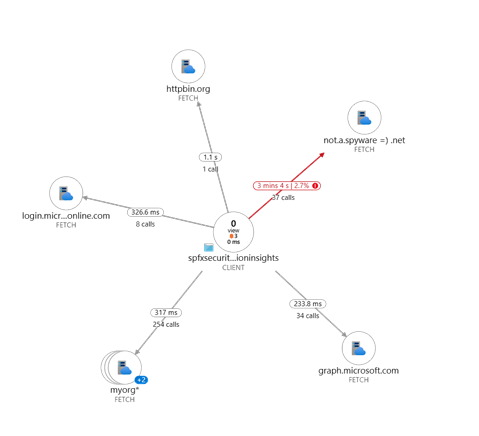
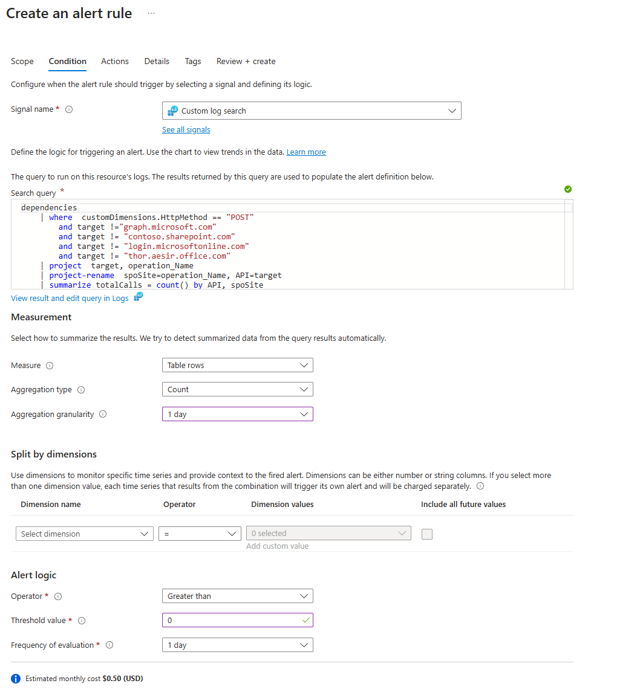

## SharePoint solutions as a spyware - series

1. [SharePoint solutions as a spyware](./../spfx-solutions-as-spyware)
1. **Trust but verify** - this article
1. Microsoft Cybersecurity Reference Architecture (MCRA) - coming soon

> This article originally appeared on https://dev.to/ site: [Trust but verify](https://dev.to/kkazala/trust-but-verify-2nck)

## Full trust solutions in Zero Trust Architecture

When assessing security risks associated with use of malicious SPFx, it's crucial to evaluate both the impact and probability of potential threats.

The financial and reputational impact is [undeniably high](https://pnp.github.io/blog/post/spfx-solutions-as-spyware/#data-exfiltration-impact).

And the probability?

> _There's not such a thing anymore as a potential attack or a potential threat. They're either threats that have been deployed and exploited or are sitting in your backend waiting to be deployed and exploited._ by Elizabeth Stephens, [CISO Workshop videos | Threat Environment and Trends](https://learn.microsoft.com/en-us/security/adoption/the-ciso-workshop-videos#threat-environment-and-trends)

This combination of high impact and high probability elevates the **risk to a critical level**.

Certainly, this doesn't mean that all SPFx solutions should be removed from your environment. Users prioritize productivity, and if essential tools are blocked, they may find ways to bypass security measures to accomplish their tasks.

Your security strategy should focus on enabling secure work practices while maintaining a balance between productivity and security risks.

## Routine part of IT process: review SPFx apps and granted API Permissions

Conduct regular reviews of installed extensions, the permissions they request, and those granted to the SharePoint Online Client Extensibility principal. Remove any unused solutions and revoke permissions that are no longer necessary.

### Manual review
To simplify the review process, you may use the [Export-SPFxApiPermissions.ps1](https://pnp.github.io/script-samples/spo-get-spfx-apipermissions/README.html?tabs=pnpps) script, which generates Excel file with two reports:

-   summary of all SPFx extensions installed in SPO sites, including site url, solution name and all API permissions declared in the manifest.
    
-   summary of API permissions assigned to the "SharePoint Online Client Extensibility Web Application Principal", including SPFx solutions that requested them.
    
    It also displays a warning if any API permissions are assigned using Application mode, which is unsupported.

> When using the script, keep in mind that a site-level app catalog, from a security perspective, functions like a regular list within a SharePoint Online site. This means that Global or SharePoint administrators do NOT have automatic access. Running the script as an administrator without first granting at least read access to the site would result in INCOMPLETE data. If the current user does not have access rights to a site hosting site-level app catalog, this script grants them Admin rights for the duration of script execution. The permissions are removed as soon as API Permissions are exported.

### Automatic cleanup

Instead of manually reviewing and deleting unused permissions, you may decide to execute the cleanup process automatically, on a schedule.

Use the [Remove unused API Permissions assigned to "SharePoint Online Client Extensibility Web Application Principal"](https://pnp.github.io/script-samples/spo-delete-unused-spfx-apipermissions/README.html?tabs=graphps) script sample as a source for your Azure Runbook, to regularly clean up API permissions assigned to the SharePoint service principal.
The `-Interactive` flag allows running the script locally as a signed in user, while `-WhatIf` flag will report recommended changes without removing any permissions.

Remember to assign permissions to the Managed Identity used by your automation. You may use the [Grant Managed Identity permissions to audit and cleanup "SharePoint Online Client Extensibility Web Application Principal" API permissions](https://pnp.github.io/script-samples/aad-grant-serviceprincipal-api-permissions/README.html?tabs=pnpps) script, which grants minimum required permissions to Microsoft Graph and selected SharePoint sites.

> Enabling the site-level app catalog requires SharePoint Administrator permissions. This presents a good opportunity to **discuss risks and security practices** with site owners, and to obtain their agreement for regular audits of the SPFx apps they install.

## Review the traffic generated by your SharePoint sites

In an era where external calls are common and often necessary, especially with the rise of reality-augmented generation (RAG) technologies, distinguishing between malicious and legitimate code or external API calls becomes challenging. The difference lies solely in the intentions behind the code.

One thing you can do to detect data exfiltration is monitoring and tracking API calls executed within any SharePoint Online (SPO) site. This can be achieved using the [SPFx Application Customizer](https://github.com/pnp/sp-dev-fx-webparts/tree/main/samples/js-applicationinsights-api-calls-tracking/) deployed tenant-wide to all SPO sites, that **tracks all API requests and sends them to Application Insights**. This solution allows whitelisting "safe" endpoints to reduce the amount of data logged. Additionally, it allows for temporarily disabling logging to facilitate randomized "hunting" without continuously generating large volumes of data.

Results can be reviewed using the Application Map in Application Insights or by executing KUSTO query against the Application Insights logs, offering powerful tools for analyzing and understanding API usage patterns.

For a more **proactive approach**, you may set up an **alert that automatically triggers** when a new external API call is detected. This mechanism allows you to stay informed whenever an unfamiliar API request occurs. If the alert conditions are met, an email notification will be sent to designated administrators or security personnel.

This approach ensures that potential threats or unauthorized activities are quickly identified, allowing for prompt investigation and response before any damage can occur.

> If the suggestion of downloading a SharePoint solution from a Git repository gave you a pause, we are on a good track. 😊
>
> No need to worry. The PnP Samples do not include pre-built solution packages. Instead, you'll need to download the code and build the solution package yourself. This allows you to review the code and ensure that the package you install matches the code you've inspected. 
>
>If you're not a developer, consider having your development team or a trusted third-party company review and build the component for you.

